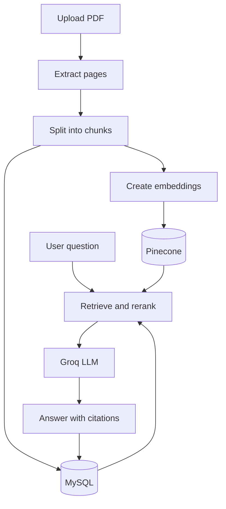

# Beginner RAG Chatbot with FastAPI

A complete, small Retrieval-Augmented Generation (RAG) backend that lets you upload PDFs and ask questions about them. It uses:

- **FastAPI** for the REST API and Swagger UI
- **SQLITE** for documents, chunks, chat sessions, and message history
- **Pinecone** for semantic vector search
- **Hugging Face's hosted inference API** for embeddings (kept out of the server process so it stays light enough for a free-tier deploy)
- **Groq** for answer generation
- Optional **BM25 hybrid search** and a lightweight reranker

The code deliberately avoids large frameworks such as LangChain so each RAG step is easy to understand.

## How it works



MySQL stores application data and readable chunk text. Pinecone stores vectors plus small metadata. The API returns citations containing the source file, page, chunk ID, and retrieval score.

## Project structure

```text
app/
├── main.py
├── config.py
├── database/       # SQLAlchemy connection, tables, API schemas
├── ingestion/      # PDF extraction, chunking, embeddings
├── vectorstore/    # Pinecone integration
├── retrieval/      # Vector, BM25, hybrid search, reranking
├── guardrails/     # Input, retrieval, and output checks
├── llm/            # Groq chat-completion client
└── services/       # Document and chat workflows
```

## Before you start

You need:

1. Docker Desktop (recommended), or Python 3.11 and MySQL 8.
2. A Pinecone account and a dense index:
   - Dimension: `384`
   - Metric: `cosine`
   - Name: `rag-chatbot` (or change the environment variable)
3. A Groq API key (free at <https://console.groq.com/keys>).
4. A Hugging Face read token (free at <https://huggingface.co/settings/tokens>), used to call the hosted embeddings API.

The default embedding model, `sentence-transformers/all-MiniLM-L6-v2`, produces 384-dimensional vectors. If you change it, recreate the Pinecone index with the new dimension.

## Run with Docker (recommended)

From the project directory:

```bash
cp .env.example .env
```

Open `.env` and replace:

```env
PINECONE_API_KEY=your_real_key
GROQ_API_KEY=your_real_key
```

Then start the API and MySQL:

```bash
docker compose up --build
```

Open:

- Swagger UI: <http://localhost:8000/docs>
- Health check: <http://localhost:8000/health>

The embedding model is downloaded on the first document upload, so the first request takes longer.

## Run locally without Docker

Create and activate a virtual environment:

```bash
python -m venv .venv
source .venv/bin/activate
pip install -r requirements.txt
cp .env.example .env
```

Start MySQL and update `MYSQL_URL` in `.env`, then run:

```bash
uvicorn app.main:app --reload
```

For a quick development-only database, you can use SQLite instead:

```env
MYSQL_URL=sqlite:///./rag_chatbot.db
```

## API walkthrough

### 1. Upload a PDF

```bash
curl -X POST http://localhost:8000/documents/upload \
  -F "file=@example.pdf"
```

### 2. Create a chat session

```bash
curl -X POST http://localhost:8000/sessions \
  -H "Content-Type: application/json" \
  -d '{"title":"PDF questions"}'
```

Copy the returned session `id`.

### 3. Ask a question

Ask about an uploaded document:

```bash
curl -X POST http://localhost:8000/chat \
  -H "Content-Type: application/json" \
  -d '{
    "session_id":"YOUR_SESSION_ID",
    "document_id":"YOUR_DOCUMENT_ID",
    "question":"What are the main conclusions?"
  }'
```

### 4. Read chat history

```bash
curl http://localhost:8000/history/YOUR_SESSION_ID
```

### 5. Rename a session

`GET /history/{session_id}` reads data. `PATCH /sessions/{session_id}` changes the title:

```bash
curl -X PATCH http://localhost:8000/sessions/YOUR_SESSION_ID \
  -H "Content-Type: application/json" \
  -d '{"title":"New title"}'
```

## Main endpoints

| Method | Endpoint | Purpose |
|---|---|---|
| GET | `/health` | Health check |
| POST | `/documents/upload` | Upload, chunk, embed, and index a PDF |
| GET | `/documents` | List uploaded documents |
| DELETE | `/documents/{document_id}` | Delete a document and its vectors |
| POST | `/sessions` | Create a chat session |
| GET | `/sessions` | List sessions |
| PATCH | `/sessions/{session_id}` | Rename a session |
| GET | `/history/{session_id}` | Get messages in a session |
| POST | `/chat` | Retrieve context and generate an answer |

## Enable hybrid retrieval

Set this in `.env`:

```env
USE_HYBRID_SEARCH=true
```

Vector search finds semantically similar content. BM25 finds exact keywords. The hybrid retriever normalizes and combines both scores, then the simple reranker rewards chunks that share important terms with the question.

For a small beginner project, BM25 is built from chunks in MySQL at query time. For a large production system, move keyword search to OpenSearch/Elasticsearch or cache the BM25 index.

## Database tables

| Table | Stores |
|---|---|
| `documents` | File name, status, size, chunk count |
| `chunks` | Chunk text, page, order, Pinecone vector ID |
| `chat_sessions` | Conversation title and timestamps |
| `messages` | User/assistant messages and JSON citations |

Tables are created automatically on startup. Use Alembic migrations before changing schemas in production.

## Run tests

Tests use SQLite and do not call Pinecone or Groq:

```bash
pytest -q
```

## Common problems

- **Pinecone dimension error:** ensure the index dimension equals `384`.
- **No useful context found:** upload a text-based PDF, lower `MIN_RETRIEVAL_SCORE`, or ask a more specific question.
- **Scanned PDF returns no text:** this starter does not include OCR. Add Tesseract or a cloud document parser.
- **Groq model error:** choose a chat-completion model available on Groq and confirm your API key has access.
- **Embedding request fails:** confirm `HF_TOKEN` is set and valid — embeddings are called via Hugging Face's hosted API, not loaded locally.
- **MySQL connection refused:** wait for its health check, verify credentials, and use hostname `mysql` only inside Docker.

## Production improvements

Before public deployment, add authentication and per-user document isolation, database migrations, background ingestion jobs, object storage, rate limits, structured logging, monitoring, secret management, and stronger prompt-injection controls. Do not expose this starter directly to the public internet with real data.

## Useful official references

- [FastAPI documentation](https://fastapi.tiangolo.com/)
- [SQLAlchemy MySQL documentation](https://docs.sqlalchemy.org/en/20/dialects/mysql.html)
- [Pinecone Python SDK](https://docs.pinecone.io/reference/python-sdk)
- [Groq API documentation](https://console.groq.com/docs)
- [all-MiniLM-L6-v2 model card](https://huggingface.co/sentence-transformers/all-MiniLM-L6-v2)
